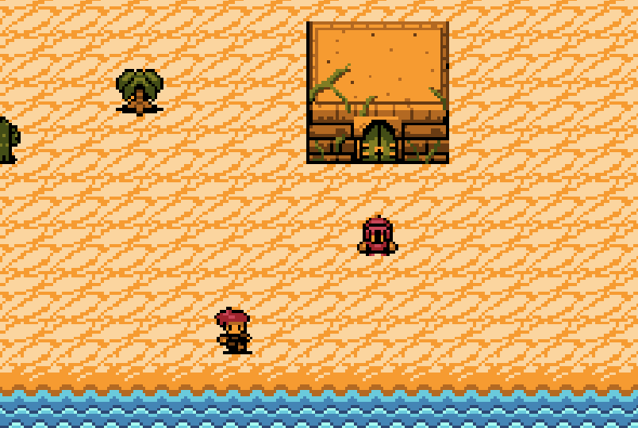

# TopDown 2d

Este proyecto es un prototipo de juego top down 2d.

Enlace itch.io https://oqubo.itch.io/topdown

Enlace GitHub  https://github.com/tonylattke/TopDownUnity

# Objetivo del juego

Explora un mundo desde una vista cenital clásica donde cada paso cuenta. Habla con NPCs, recoge objetos, gestiona tu inventario y adéntrate en una mazmorra generada aleatoriamente llena de peligros, tesoros y un jefe esperando al final.

# Controles

- Moverse: Flechas del teclado
- Interactuar / Recoger: E
- Abrir inventario: I
- Combate: apuntan con ratón y hacer click izquierdo

# Características principales
- Exploración 2D estilo top-down con desplazamiento por casillas.
- Interacción con NPCs y objetos, inventario funcional.
- Mazmorra procedural con salas interconectadas generadas aleatoriamente.
- Trampas y peligros: Esquiva bolas rojas en movimiento que te hacen daño.
- Monedas coleccionables que otorgan puntos.
- Puerta verde en la sala inicial para volver al pueblo.
- Puerta roja hacia el jefe, ubicada en la sala más lejana.
- Combate final en estilo free flow contra varios enemigos.​

# Detalles de implementación
- Eventos lanzados al recibir daño o recoger monedas, observados por UIManager y SoundManager para actualizar interfaz y sonido.
- Singletons para gestionar UI, sonido y lógica del juego.
- Máquinas de estados
- Diseño orientado a objetos para enemigos, trampas y lógica general (Herencia, Encapsulamiento, etc).

